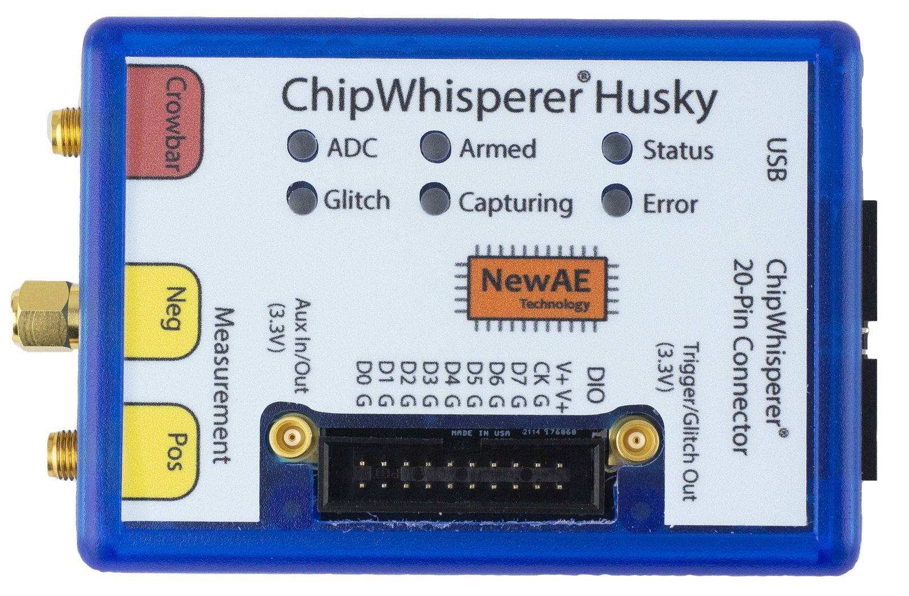
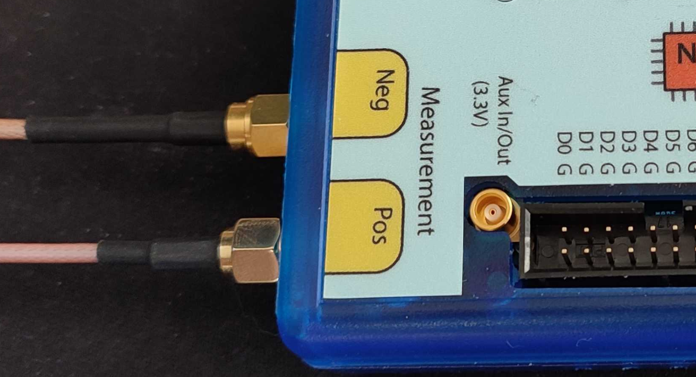
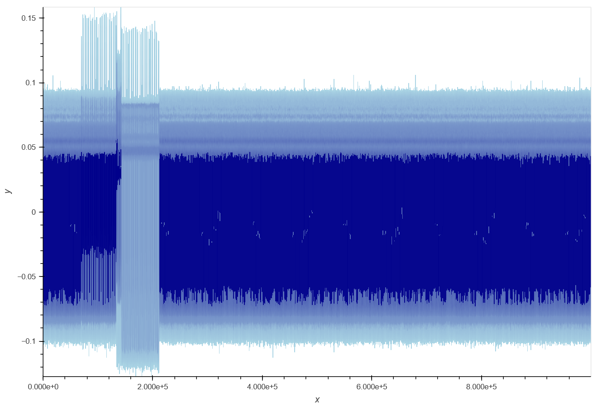
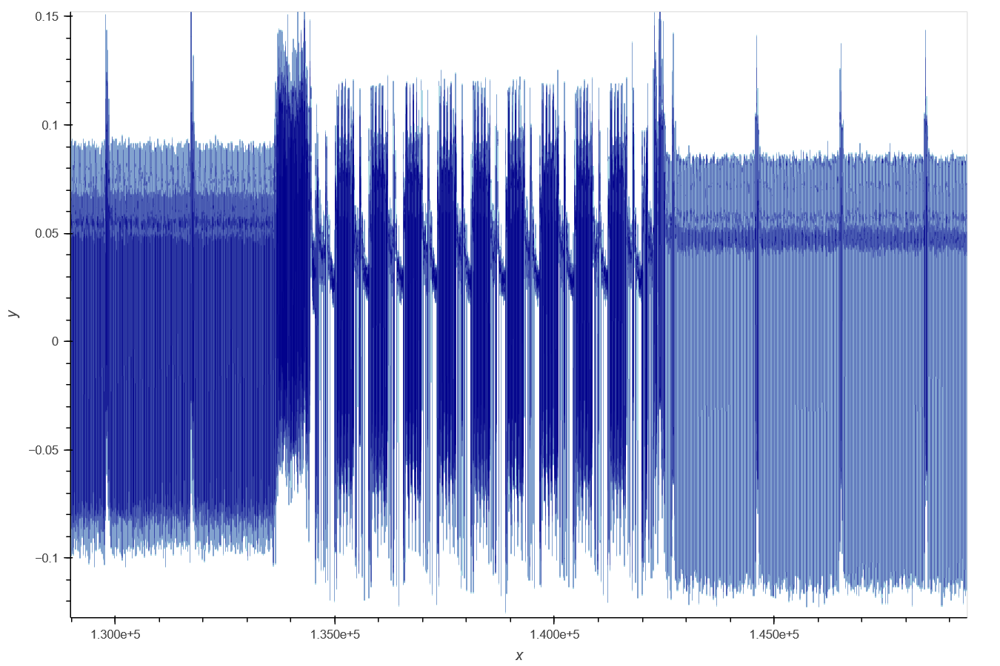
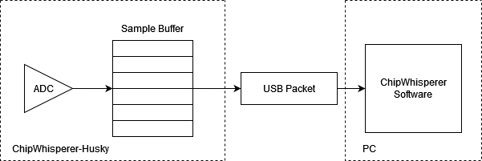

# ChipWhisperer-Husky

ChipWhisperer-Husky is the successor to the CW1173 ChipWhisperer-Lite. It
has many improvements over its predecessor, including a higher resolution
and faster ADC, a bigger FPGA enabling additional features that were
exclusive to the ChipWhisperer-Pro, and more flexible clocking.

Husky-Plus has the same capabilities but with several upgraded specs, which
are listed [here](overview.md#chipwhisperer-husky-plus-features-over-chipwhisperer-husky).



## Crowd Supply Page

[https://www.crowdsupply.com/newae/chipwhisperer-husky](https://www.crowdsupply.com/newae/chipwhisperer-husky)

---
## Quick-Start Guide

Hardware setup is fast and easy! Connect your ChipWhisperer-Husky to a computer using a USB-C cable. 
Next, connect both a 20-pin cable between the CW 20-pin Connector and the target, as well as a coax cable
between the measure POS SMA (if you're doing power analysis) or the glitch 
SMA connector (if you're doing voltage glitching) and the SMA connector on the target. 
For other targets, check the relevant target documentation.

Once that's done, follow our {doc}`installation guide <../installation>`, which
will take the rest of the way towards learning about side channel attacks!

---
## Product Highlights

* Synchronous (capture board and target board both use the same clock) capture and glitch architecture, 
offering vastly improved performance over a typical asynchronous oscilloscope setup
* 12-bit 200MS/s ADC for capturing power traces
    - Can be clocked at both the same clock speed as the target, as well as integer multiples of this frequency.
* +55dB adjustable low noise gain, allowing easy measurement of small signals
* Clock and voltage fault generation via FPGA-based pulse generation
* XMEGA (PDI), AVR (ISP), SAMBA (Microchip SAM) and STM32F (UART Serial) bootloader built in
* JTAG/SWD debugging lines on CW 20-pin connector, as well as JTAG compatible 20-pin digital header
    * Only works via OpenOCD
* Streaming mode (>20MS/s 8-bit max) for long captures
* Trigger Out/Glitch Out SMB Connector
* Aux In/Out SMB Connector
* TraceWhisperer Arm Trace sniffing/triggering
* 20-pin User IO header (8 Data Pins), can be used for :
    * JTAG/SWD (20-pin JTAG compatible) 
    * Arm Trace
    * User Controlled
    * Logic Analyzer
    * Trigger pins
* Many trigger modes:
    * Basic (Rising edge, falling edge, high, low)
    * Analog threshold
    * Analog Pattern (Sum of Absolute Difference, up to 512 samples)
    * UART byte
    * Edge count
    * Arm Trace
    * Sequenced triggers
* Glitch based on internal VCO means glitch resolution isn't based on target clock
* Multiple programmable glitches

---
## Specifications

### Analog Capture and Clock

| **Feature**  | Notes/Range |
| -------   |------ |
| **ADC Specs** | 12-bit 200MS/s (Husky Plus: 250MS/s)|
| **ADC Clock Source** | PLL generated/External (Integer multiple)
| **Analog Input** |  AC-Coupled, adjustable low-noise gain from -6.5dB to 55dB 
| **Sample Buffer Size** | 131124 samples (Husky Plus: 327828 samples) |
| **ADC Decimation**   | Yes |
| **ADC Offset Adjustment** | Yes, [0, 2^32) clock cycles |
| **ADC Trigger** | Rising-edge, Falling-edge, High, Low | 
| **Presampling** | Yes |
| **Phase Adjustment** | Yes | 
| **Capture Streaming** |  Yes |
| **Clock Generation Range** | 5-200MHz | 
| **Clock Output** | Regular, with glitch inserted, glitch only | 

---
### Triggering

| **Feature**  | Notes/Range | 
| -------   | ----------- |
| Modules   | Basic, Analog, UART, Edge Count, Arm Trace |
| Analog Trigger | Sum of Absolute Difference (up to 512 samples), Analog Threshold |
| Basic Trigger Inputs | TIO 1-4, nRST, SMB, User IO D0-7 |
| Basic Trigger Combination | One of OR, AND, NAND | 

---
### IO
| **Feature**  | Notes/Range | 
| -------   | ----------- |
| GPIO Voltage | 3.3V | 
| Logic Outputs | TIO 1-4, nRST, PDIC, PDID | 
| Logic Inputs | TIO 1-4 | 
| UART Serial | TIO 1-4 assignment | 
| Clock | Fixed, HS2 output, HS1 Input | 
| Trigger Out | Yes | 
| Programmers | STM32F UART, Atmel PDI (for XMEGA), Atmel ISP (for AVR) | 
| Power rails | 3.3V | 
| User IO Pins | 8 Data pins: JTAG, SWD, Arm Trace, Generic |

---
### Glitch

| **Feature**  | Notes/Range |
| -------   | ----------- |
| Voltage Glitching | Yes | 
| Clock Glitching | Yes | 
| Glitch Outputs | Clock-XOR, Clock-OR, Glitch-Only, Enable-Only | 
| Glitch Width \* | Based on Internal PLL (600-1200MHz), 100% (enable-only) | 
| Glitch Width Increments | Based on Internal PLL (600-1200MHz) | 
| Glitch Offset | Based on Internal PLL (600-1200MHz) | 
| Glitch Offset Increments | Based on Internal Pll (600-1200MHz) | 
| Glitch Cycle Offset | [0, 2^32) | [0, 2^32) | N/A |
| Glitch Cycle Repeat | [0, 8192] | [0, 8192] | N/A |
| Voltage Glitch Type | High-power, low-power crowbar | 
| Voltage Glitch Pulse Current | 20A | 
| Glitch Trigger | Rising-Edge |

\* Actual glitch width will be affected by cabling used for glitch output

---
### USB

| **Feature**  | Notes/Range |
| -------   | ----------- |
| USB | USB 2.0 High Speed | 
| VendorID | 0x2B3E | 
| ProductID | 0xACE5 | 
| Interfaces | Vendor + CDC or Vendor + MPSSE |
| WCID (Windows 10 automatic driver installation) | ✅ |
| MPSSE (FTDI JTAG/SWD) | ✅ |

---

## Using the ChipWhisperer-Husky

All communication with the ChipWhisperer-Husky is done through ChipWhisperer's Python
API, which is documented on our {ref}`Scope API <api-scope>` page.

ChipWhisperer also has many Jupyter Notebook tutorials/labs, which serve as learning material for side-channel
attacks, as well as examples on how to use the ChipWhisperer API. If you followed the
{doc}`installation instructions <../installation>`,
this will be in the `jupyter/` folder in the place you installed 
ChipWhisperer.

We also have full courses available at https://learn.chipwhisperer.io/ that supplement
the Jupyter Notebook tutorials.

---

### Connectors

#### **Glitch/Crowbar Port**

The "Crowbar" port is used for voltage glitching. It's connected to two
MOSFET elements, as the following figure shows:


The Husky glitch output can be commanded to turn on either of those
MOSFETs via `scope.io.glitch_hp` and `scope.io.glitch_lp` fields:

```python

scope.io.glitch_hp = True #enable high power glitch
scope.io.glitch_hp = False #disable high power glitch

scope.io.glitch_lp = True #enable low power glitch
scope.io.glitch_lp = False #disable low power glitch
```

Be careful using this feature, as you don't want to short the MOSFETs
for too long. It's also possible to damage the ChipWhisperer-Husky by
burning these MOSFETs up if used incorrectly. See [Fault101 Voltage Glitch Labs](https://github.com/newaetech/chipwhisperer-jupyter/tree/master/courses/fault101)
for more information.

Note that Husky's glitch module behaves differently than the Lite, Nano's or Pro's. As such, you may want to check
out our [notebook on Husky glitching](https://github.com/newaetech/chipwhisperer-jupyter/blob/master/demos/husky/03%20-%20Husky%20Glitching.ipynb)

---

#### **Measurement Ports**

The "Measurement" ports are the inputs to the low-noise amplifier and ADC.

The Husky includes support for both single ended and differential measurements. 
If you want to use the single ended measurement, it is recommended that you connect
the provided short circuit cap as this makes the resulting power trace slightly less noisy
and improves gain/frequency performance.




--- 
#### **20-Pin Connector**

The 20-pin connector is documented [here](20-pin-connector.md).

---

#### **User IO Header**

Like the PhyWhisperer-USB, the ChipWhisperer-Husky has a 20-pin User IO header connected to the FPGA.

The pinout is as follows:

| Pin: Func | Pin: Func |
| ------ | ------ |
| 1: 3.3V | 2: 3.3V |
| 3: Clock | 4: Gnd |
| 5: D7 | 6: Gnd |
| 7: D6 | 8: Gnd |
| 9: D5 | 10: Gnd |
| 11: D4 | 12: Gnd |
| 13: D3 | 14: Gnd |
| 15: D2 | 16: Gnd |
| 17: D1 | 18: Gnd |
| 19: D0 | 20: Gnd |

This pinout is also listed on the front panel sticker of the Husky. The following output modes are available
for the data pins:

* Normal (Default) - Data pins as GPIO
* Trace - Data pins used for Arm Trace debug
* FPGA Debug - Data pins routed to internal FPGA signals
* Debug JTAG - Data pins routed for 20-pin JTAG compatibility
* Debug SWD  - Data pins routed for 20-pin JTAG compatibility, SWDIO as I/O

These data pins can also be used as trigger inputs for the ChipWhisperer.

---

#### **SMB I/O**

The Husky has two additional SMB connectors that can be used for useful inputs/outputs.

The first is a Trigger/Glitch out, allowing you to use the Husky's 
many different trigger modules with other devices. Examples of this
include using the Husky to trigger a ChipSHOUTER or an external oscilloscope.

The other SMB connector can be used as either a trigger/clock input,
or as a clock output.

---


### **Upgrading SAM3U Firmware**

When talking about the ChipWhisperer's firmware, there is really two
parts to this:

1.  The FPGA Bitstream file.
2.  The SAM3U USB interface chip firmware.

The FPGA bitstream alone is what is normally configured by the
ChipWhisperer software. This bitstream is always the most
up-to-date, since it's automatically reloaded by the computer every time
you power cycle the ChipWhisperer-Husky. The SAM3U firmware is
not updated automatically, but it tends to change less frequently.

To learn how to check your SAM3U firmware version and how to upgrade, go to {doc}`../firmware`.

---

#### **Erase Pins/Button**

If you are unable to connect to the ChipWhisperer-Husky to erase its firmware, the SAM3U firmware
can also be erased by shorting SJ1 while the Husky is on. 

**Depending on what revision of the Husky you have,
you may have an erase button that you can press using a needle or wire. If present, this button will be present
on the other side of the 20-pin connector from the USB-C connector.**

Otherwise, you must open the Husky to erase it. SJ1 is located on the same side as the 20-pin User IO header, 
by the 10-pin SAM3U debug header, near the middle of the board. If your Husky has the aforementioned button, SJ1
won't be present.


After shorting the pins or pressing the erase button, unplug and replug the USB connector.

See {doc}`../firmware` for more information on erasing and re-programming ChipWhisperer-Husky firmware.


### Advanced Features

Advanced features are covered in depth in 
[our series of Husky-specific demo notebooks](https://github.com/newaetech/chipwhisperer-jupyter/tree/main/demos/husky);
here we provide a brief overview.

#### **TraceWhisperer**

Arm Trace is an advanced debug feature of Arm processors allowing
debug information to be streamed off of a microcontroller while it is running.
A more complete description is available on [Arm's Website](https://developer.arm.com/).

[TraceWhisperer](https://github.com/newaetech/tracewhisperer), an Arm Trace sniffer by NewAE,
has been integrated into ChipWhisperer-Husky.

This integration enables a bunch of cool features such as identifying where in power traces instructions are being executed:


Matching power traces with the functions being executed:


And identifying time-based leakage:


You can also use ChipWhisperer-Husky to trigger based on Arm Trace data, which will be covered later.


---

#### **Streaming Mode**

The ChipWhisperer Husky has a streaming mode that allows extremely long
captures as long as relatively low sampling rates are used. For example,
this plot shows an excerpt from an AES trace with 1 million samples:



If we zoom in, we can still see the familiar AES structure



This capture mode is useful for many types of attacks, including:

  - Full captures of slow software AES libraries
  - Power analysis on ECC/RSA
  - Context switches on embedded operating systems

While streaming, the ChipWhisperer hardware sends ADC data back to the
capture software while recording more samples (instead of waiting until
the end of the capture). During this process, the ADC samples are sent
back to the computer in packets. The packet size can be adjusted, but is 64k samples long by default.
As a block diagram, this looks like:



The main danger in streaming mode is that the FPGA's sample buffer can
overflow if the PC doesn't request these packets quickly enough. This means
that the Husky has a max sampling frequency in stream mode somewhere above
20MS/s (AKA 20MHz ADC clock) if the ADC is run in 8-bit mode. 
In practice the max sampling rate is usually around 25MS/s,
with things like temperature, various USB factors, and the packet size affecting this value.

Trying to stream above this rate will usually cause data to be corrupted. If this happens,
you will be informed of the data corruption when reading data back.

On the software end, there are two things to watch for:

  - Long captures from streaming mode (millions of points) may take
    several seconds to record. When working with these long captures,
    make sure the software's timeouts (`scope.adc.timeout`) are long enough.

  - Extremely long captures take a lot of memory. 64-bit Python is
    recommended if you plan on capturing many traces with millions of
    samples - you can hit the memory limit on 32-bit Python pretty
    quickly.

Also keep in mind that these numbers are for 8-bit captures. If you want to stream
12-bit data, the max sampling frequency will be roughly `12/8` times
slower. For example, 20MS/s at 8-bits per sample is roughly equivalent to 13MS/s at 
12-bits per sample.

---

#### **Multiple Programmable Glitches**

Often, when glitching, you'll want to target multiple instructions at the same time.
For example, glitching an RSA signature operation and capturing the malformed signature
can allow you to recover the key. To guard against that, many implementations
validate the signature before sending it out. As earlier ChipWhisperers could only glitch one portion of code at a time, 
our [RSA glitch lab](https://github.com/newaetech/chipwhisperer-jupyter/blob/master/courses/fault201/SOLN_Lab%202_1%20-%20Fault%20Attack%20on%20RSA.ipynb) 
requires modified source code that disables this final check.

With the ChipWhisperer-Husky, this is no longer necessary. This is because of a new feature - multiple
programmable glitches, allowing it to insert up to 32 glitches with different `ext_offset` and `repeat`
based off of a single trigger. For example, you could glitch both the RSA calculation and the signature verification.
To use this new mode, begin by setting the number of glitches you want to insert:

```python
# ... normal glitch setup
scope.glitch.num_glitches = 3 # insert 3 glitches
```

From here, `ext_offset` and `repeat` are replaced by arrays, allowing you to easily
set each glitch's setting. For example, we'll keep the repeat at 5 for each glitch,
but insert them at `ext_offset`s of 50, 200, and 500:

```python
scope.glitch.repeat = 5 # equivalent to [5, 5, 5]
scope.glitch.ext_offset = [50, 200, 500]
```

Note that `scope.glitch.width` and `scope.glitch.offset` are shared between these glitches.

---
#### **Trigger Module**

In total, the ChipWhisperer-Husky has six different trigger methods,
allowing you to perform power analysis or glitch in a large number of
situations.

This page will give a quick overview of each trigger, but we also have
a [Jupyter Notebook that demos these triggers](https://github.com/newaetech/chipwhisperer-jupyter/blob/main/demos/husky/02%20-%20Husky%20Triggers.ipynb)

---

#### **Edge/Level**

The edge/level detector can trigger on four different events:

  - Trigger input is low (0)
  - Trigger input is high (1)
  - Trigger input had a rising edge (0 -\> 1)
  - Trigger input had a falling edge (1 -\> 0)

This mode is suitable when the target is using one of the GPIO pins as a
trigger signal - if you have control over the target's source code, let
it output a rising edge when the encryption or other operation begins.

---
##### **Analog Threshold**

The Husky can also trigger on an analog threshold level. This mode is similar
to the analog trigger of an oscilloscope:

```python
scope.trigger.module = 'ADC'
scope.trigger.level = 0.3
```

The "level" has the same scale as the ADC data returned from the ADC. As an example,
if the device varies from -0.1 to 0.1 on the graph when idle, then spikes to
-0.3 when it does an interesting operation, a good `scope.trigger.level` might be
-0.2


---
##### **UART**

The UART trigger module looks for a pattern of characters on the trigger
pin and, if it detects that pattern, outputs a trigger. Up to 8 patterns
can be set at a time. For documentation and usage, see:
{py:meth}`scope.UARTTrigger() <chipwhisperer.capture.trace.TraceWhisperer.UARTTrigger>`.


---

##### **Sum of Absolute Differences (SAD)**

Some targets don't have nice trigger signals to detect. Sad\!

The Sum of Absolute Differences module has two 256-sample buffers. The
FPGA stores the ADC's 256 most recent samples in one buffer and a fixed
reference pattern in the other. Then, after every sample, it calculates
whether the absolute difference between the acquired samples and the
reference pattern exceeds some programmable threshold.

Moreover, Husky has a special "extended SAD" mode which allows the SAD
comparison to be done over 512 samples.

This trigger allows ChipWhisperer to detect a specific pattern (for
instance, an encryption operation) in a power trace without any other data.

The documentation for the SAD module can be found 
{py:meth}`here <chipwhisperer.capture.scopes.cwhardware.ChipWhispererSAD.HuskySAD>`.

There are many SAD settings to configure; 
[this notebook](https://github.com/newaetech/chipwhisperer-jupyter/blob/main/demos/husky/06%20-%20Husky%20SAD%20Triggering.ipynb)
teaches how.

Note that the SAD module does not play well with downsampling (decimation): the
inputs to the SAD buffer are not downsampled. This means that
downsampled traces cannot be used as a reference. If you want to use
this trigger type, set up your SAD trigger with downsampling turned off
first.

---

##### **Arm Trace Trigger**

Thanks to TraceWhisperer integration, you can trigger the ChipWhisperer-Husky based on 
Arm Trace data.

Due to the amount of debug information you have access to in real time with Trace, TraceWhisperer
allows you to set up highly specific testing scenarios for your device under test for both power analysis
and glitching.

The documentation for this module can be found 
{py:meth}`here <chipwhisperer.capture.trace.TraceWhisperer.TraceWhisperer>`.

We also have a [Jupyter Notebook Demo](https://github.com/newaetech/DesignStartTrace/blob/master/jupyter/TraceWhisperer.ipynb) that showcases may features of TraceWhisperer, including triggering.


---

##### **Edge Count Trigger**

This module counts the rising and falling edges of the trigger pin and issues
a trigger after a specified number of edges. This module is very useful for triggering
based on protocols that the Husky doesn't support, such as SPI, I2C, etc.

For example to trigger on the third edge of TIO1:

```python
scope.trigger.module = 'edge_counter'
scope.trigger.triggers = 'tio1'
scope.trigger.edges = 3
```

Husky can also tell you how many triggers it saw. This is useful in the case
that the trigger times out:

```python
print(scope.trigger.edges_seen)
```

---

##### **Sequenced Triggers**

Husky also supports the *sequencing* of triggers, where a number of triggers
of different types must occur in a defined sequenced in order for the scope
to actually trigger. This is covered in detail in 
[this notebook](https://github.com/newaetech/chipwhisperer-jupyter/blob/main/demos/husky/04%20-%20Husky%20Trigger%20Sequencer.ipynb).


---

## Errata/Notes

### C49 Capacitor

Newer ChipWhisperer Husky models (Revision D and later) include an 0402 capacitor placed at C49 which is not present in earlier models to improve performance. The recommended value of this capacitor is 47pF, which puts the cutoff frequency of this filter above the Nyquist rate of the Husky's sample rate while greatly improving performance on slower AES implementations. Note that larger capacitances may further improve low frequency performance, but will reduce the bandwidth of the Husky.

Users who wish to add, remove, or change this capacitor do so at their own risk and attempting any hardware modification will void the warranty of the device.

## Schematic

Available at: [https://raw.githubusercontent.com/newaetech/chipwhisperer-husky/main/schematic/NAE-CWLITE-HUSKY-03.PDF](https://raw.githubusercontent.com/newaetech/chipwhisperer-husky/main/schematic/NAE-CWLITE-HUSKY-03.PDF)

## Firmware

Firmware for the Husky can be found at [https://github.com/newaetech/chipwhisperer-husky](https://github.com/newaetech/chipwhisperer-husky). The ChipWhisperer-Husky SAM3U firmware is in the `ChipWhisperer-Husky`,
while the FPGA firmware is in the `chipwhisperer-husky-fpga` submodule.


