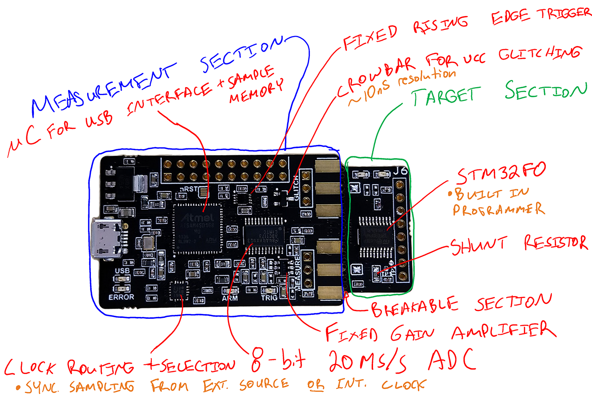
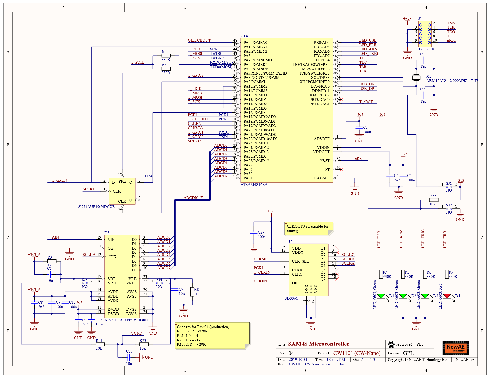
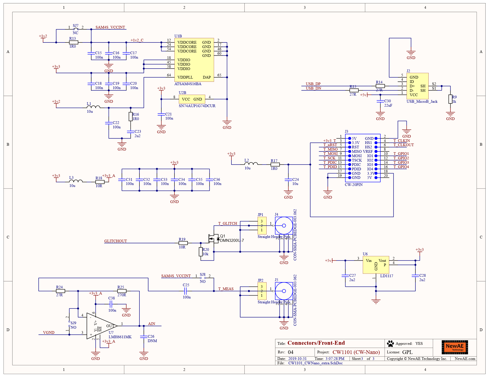

# CW1101 ChipWhisperer-Nano

The ChipWhisperer-Nano is the lowest cost platform for performing side-channel 
power analysis attacks in training and educational environments. This 
device has a smaller subset of features compared 
to the ChipWhisperer-Lite or -Pro, but still allows you to perform 
many of NewAE's side channel tutorials and demos.

**NOTE:** This page will only cover the capture side of the board.



Available in the [ChipWhisperer-Nano Starter Kit](../Starter%20Kits/ChipWhisperer-Nano.md)

[Datasheet](https://media.newae.com/datasheets/NAE-CW1101_datasheet.pdf)

---

## Quick-Start Guide

Like with the 1-part CW1173, hardware setup is easy! Simply use a
micro-usb cable to connect the ChipWhisperer-Nano to a computer or laptop.

Once that's done, follow our {doc}`installation guide <../installation>`, which
will take the rest of the way towards learning about side channel attacks!

---

## Product Highlights

ChipWhisperer-Nano is an ultra low-cost platform for side-channel power
analysis & voltage fault injection. It has the following features:

*  ADC capable of sampling up to 20 MS/s, using either external clock
    (synchronous to device) or internal clock (both synchronous and
    asynchronous).
*  ADC hardware trigger uses rising-edge input and starts sampling on
    first device clock after trigger line going high, samples for
    user-configurable length.
*  STM32F030 target for loading example code onto, including a
    programmer built into the ChipWhisperer-Nano.
*  Crowbar based VCC glitching, approx 10nS resolution on glitch width
    and offset (glitch offset from trigger with up to 200nS jitter).

It is primarily designed for power analysis demonstrations and training
programs. It is also available as a module without a target for
integration onto a target board, as one option for
ChipWhisperer-Enabling your development platforms.

---

## Specifications

| **Feature**  | Notes/Range |
| -------   |------ |
| **ADC Specs** | 8-bit 20MS/s |
| **ADC Clock Source** | Internally generated, external input | 
| **Analog Input** |  AC-Coupled, fixed gain of ~10dB |
| **Sample Buffer Size** | 50 000 samples |
| **ADC Decimation**   | No |
| **ADC Offset Adjustment** | No |
| **ADC Trigger** | Rising-edge | 
| **Presampling** | No |
| **Phase Adjustment** | No | 
| **Capture Streaming** |  No |
| **Clock Generation Range** | 60MHz, divisible by 1, 2, 4, 8, or 16 | 
| **Clock Output** | Regular only | 

---
### Triggering

| **Feature**  | Notes/Range | 
| -------   | ----------- |
| Modules   | Basic |
| Analog Trigger | N/A |
| Basic Trigger Inputs | TIO 4 |
| Basic Trigger Combination | N/A | 

---
### IO
| **Feature**  | Notes/Range | 
| -------   | ----------- |
| GPIO Voltage | 3.3V | 
| Logic Outputs | TIO 1-4, nRST, PDIC, PDID | 
| Logic Inputs | N/A | 
| UART Serial | TIO 1 (RX), TIO 2 (TX) | 
| Clock | Fixed, HS2 output, HS1 Input | 
| Trigger Out | No | 
| Programmers | STM32F UART | 
| Power rails | 3.3V | 

---
### Glitch

| **Feature**  | Notes/Range |
| -------   | ----------- |
| Voltage Glitching | Yes | 
| Clock Glitching | No | 
| Glitch Outputs | Glitch-Only | 
| Glitch Width\* | Time increments between \[0, 2^32) increments | 
| Glitch Width Increments | ~8.3ns | 
| Glitch Offset | Time increments between \[0 , 2^32) increments, ~200ns jitter| 
| Glitch Offset Increments | ~8.3ns | 
| Glitch Cycle Offset | N/A |
| Glitch Cycle Repeat | N/A |
| Voltage Glitch Type | Low-power crowbar | 
| Voltage Glitch Pulse Current | 4A | 
| Glitch Trigger | Rising-Edge |

\* Actual glitch width will be affected by cabling used for glitch output


---
### USB

| **Feature**  | Notes/Range |
| -------   | ----------- |
| USB | USB 2.0 Full Speed | 
| VendorID | 0x2B3E | 
| ProductID | 0xACE0 | 
| Interfaces | Vendor + CDC (CDC available on firmware >= 0.30) |
| WCID (Windows 10 automatic driver installation) | ✅ (firmware >= 0.22) | 

---

## Using the ChipWhisperer-Nano

All communication with the ChipWhisperer-Nano is done through ChipWhisperer's Python
API, which is documented on our {ref}`Scope API <api-scope>` page.

ChipWhisperer also has many Jupyter Notebook tutorials/labs, which serve as learning material for side-channel
attacks, as well as examples on how to use the ChipWhisperer API. If you followed the
{doc}`installation instructions <../installation>`,
this will be in the `jupyter/` folder in the place you installed 
ChipWhisperer.

We also have full courses available at https://learn.chipwhisperer.io/ that supplement
the Jupyter Notebook tutorials.

---
### Using from Other Languages

While the ChipWhisperer API is written in Python, any language that can talk to libusb should be
compatible. This will require you to write your own backend and is officially unsupported
by NewAE.

---
### Connectors

#### Glitch Port

The "Glitch" port can be activated by increasing `scope.glitch.repeat`:

```python
scope.glitch.repeat = 10 # ~83ns glitch

scope.glitch.repeat = 0 # no glitch
```

---
#### **Measure Port**

  The "Measure" port is the input to the low-noise amplifier and ADC.

--- 
#### **20-Pin Connector**

The 20-pin connector is documented [here](20-pin-connector.md).


---
### **Examples of Tutorials you can Run**

The ChipWhisperer-Nano is capable of completing many of NewAE's 
tutorials and labs. For example, it can complete the following:

* SCA101 (except for the UART triggering lab)
  * SPA attack on a password check
  * DPA and CPA attacks on AES
  * CPA attack on MBED-TLS AES implementation
* Fault101 (voltage glitching only)
  * Corrupting calculations
  * Password bypass
* DPA attack on XOR password check

If you were to attach an external target, you could also do the
following:

  - Perform a CPA attack on a hardware AES accelerator.
  - Perform a power analysis attack on a FPGA target.
  - Perform the LPC1114 tutorial.
  - Connect to CW308 UFO Board for use with a wide variety of targets.

---
### **Limitations compared to ChipWhisperer-Lite and Pro**

The ChipWhisperer-Lite and Pro both use an FPGA for performing all clock
routing, in addition to using better ADCs and analog front ends.
Fundamentally, the design of the ChipWhisperer-Nano means it has the
following major limitations:

  - Sampling clock in external mode directly follows the input clock (no
    ability to multiply/divide/offset clock as in CW1173/CW1200).
  - Sampling clock in internal mode limited to specific fixed divisions
    of 240 MHz PLL clock.
  - Fixed analog front-end gain of approx 10dB.
  - ADC limited to 20MS/s (can be overclocked slightly, up to 30MS/s but
    not guaranteed).
  - No ADC offset to delay capture for some specific number of cycles
    after the trigger.
  - Cannot generate clock glitching waveforms.
  - VCC crowbar limited to coarse offset and width steps.
  - Considerable jitter on glitch offset (due to interrupt-based
    source).
  - Rising edge trigger only.
  - Full-speed USB instead of high-speed USB.

Note that despite these limitations, ChipWhisperer-Nano can be used for
attacking real devices. You can attack hardware crypto running on a
microcontroller, or use power-analysis to recover a bootloader password
or key. The fundamental synchronous architecture of the device (which
powers all of our capture hardware tools) means it achieves considerably
better performance than a regular asynchronous oscilloscope, even when
that oscilloscope is running 5-20x faster.

---

### **Connecting to External Targets**

You have two options for connecting to external targets: to either break
off the STM32F0 end, or to program it with a loop that keeps all I/O in
tristate mode. Either way you will also need to add the following
connectors:

  - 20-pin connector (follows standard 20-pin pinout).
  - Either 3-pin headers on MEASURE and GLITCH, or SMA connectors (only
    if end is broken off).

---
#### **Tri-State via Program**

If using the tri-state mode, you should ensure the PDIC line is held LOW
to avoid accidentally entering bootloader mode on the STM32F0.

There will be some additional noise due to the STM32F0 being on the
power line. You can reduce this by opening the solder jumper that links
the STM32F0 to the input stage.

---
#### **Cutting end Off**

Similar to the ChipWhisperer-Lite, you can break off the end section. To
do that, you will have to do the following:

1.  Use an xacto knife or similar to deeply score along the perforated
    holes on both top and bottom, being very careful not to cut towards
    or near your hand. You will need to hold the CWNANO in an
    appropriate jig or vice.
2.  Align the holes on the edge of a hard surface (suggested: block of
    wood), and firmly push down on the target end while pushing against
    down the PCB against the edge. The objective is to avoid flexing the
    PCB which is likely to break components or solder joints.
3.  With appropriate protection from the fiberglass dust, lightly sand
    the broken edges.

---

### **Beta Versions**

There exist TWO beta (pre-release) versions floating around. The two
versions were released at these events:

1.  CHES 2018 version
2.  arm TechCon version

These versions have some limitations. First, they have not been well
tested and were not built under the normal production processes, so are
not guaranteed to be as reliable w.r.t. soldering. Second, they have
some specific hardware changes relative to the production units:

1.  arm TechCon and CHES version (-01 and -02 PCB revs): If you cut/snap
    the target off, the GPIO4 (trigger) pin is not connected. As this
    pin is required to be used for the ADC trigger, we recommend not
    cutting the targets off these versions. The GPIO4 trace is
    incorrectly routed THROUGH the target section. If you'd like to use
    an external target, either erase the STM32F0 or remove the IC.
2.  CHES version (-01 PCB rev) does not have the amplifier on the
    front-end. This results in poor analog performance.

---
### **Upgrading SAM3U Firmware**

To learn how to check your SAM3U firmware version and how to upgrade, go to {doc}`../firmware`.

---

#### **Erase Pins**

If you are unable to connect to the ChipWhisperer-Nano to erase its firmware, the SAM4S firmware
can also be erased by shorting SJ1 the Nano is on. With the USB connector
above, SJ1 is on the backside of the board, near the top, and has the text `ERASE` below
it.

After shorting the pins, you should
see no LEDs lit (the ERROR LED may be very dimly lit).

See {doc}`../firmware` for more information on erasing and re-programming ChipWhisperer-Nano firmware.

---
## Schematic




## Errata

### ADC/Target Phase Offset Causes Clipping

The Nano uses a clock divider in the SAM4S to generate the target and ADC clocks. The SAM4S doesn't provide
a method of synchronizing these clocks, meaning the phase offset between the two will be different each time
the chip is started. For some offsets, this can cause recorded power traces to clip.

Note that depending on where the clipping is happening, power traces that clip may still work for power analysis.

#### Workaround

Use `scope.reset_clock_phase()` to restart the PLLs until power traces do not clip.
