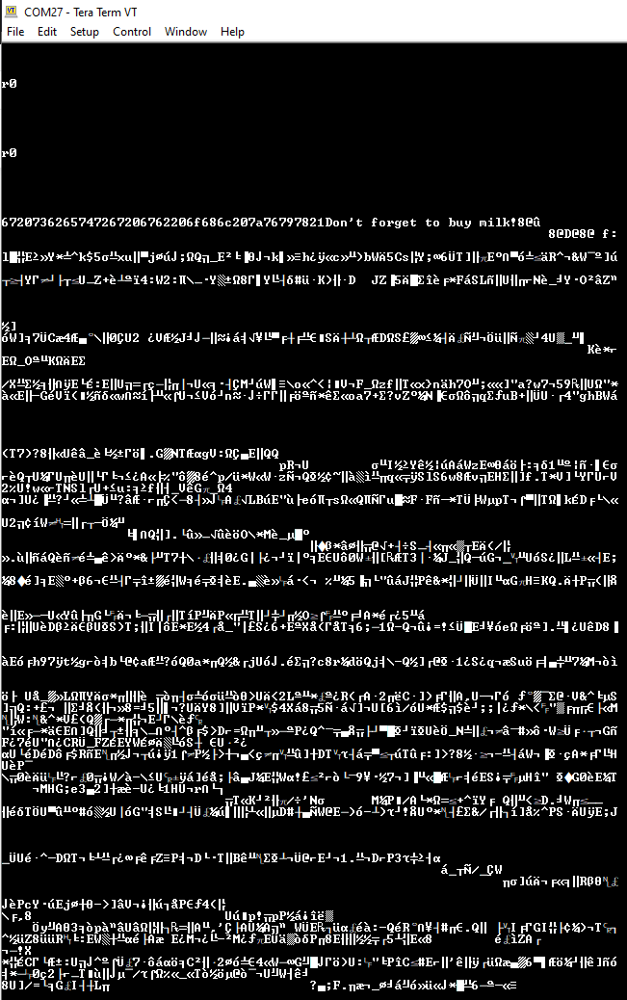

# Serial Ports

## Overview

Starting with firmware released with ChipWhisperer 5.5, ChipWhisperer capture devices
can enumerate as both a custom USB device, as before, as well as a USB CDC serial port.

This new serial port allows you to use a serial client, such as Tera Term or PuTTY, to send and
receive USART data on the ChipWhisperer in the same way target module is normally used. These two
USART methods can be used individually as they have separate RX buffer, or both at the same time,
though we recommend that you don't send messages on both at the same time.

This new serial port has a few advantages:

* Periodic polling by the OS means dropped RX data should be rare
* The RX buffer on the OS means reading serial data costs almost no program time
    - With the cw target module, reading serial data, for example, slows down a capture loop
* Can send/receive serial data using either Python, or a serial client (though not both at the same time)

As well as a few disadvantages:

* Need to keep track of a serial port (`/dev/ttyACM*` or `COMX`) if not using pyserial
    - Old versions of PySerial don't allow us to figure out the correct
        serial port from the custom USB interface, meaning the serial port must also be input manually.
* USART settings can be changed by the serial client, which will mess up your communication
    if you're using the target module to communicate with the target.

This last concern is addressed by the ChipWhisperer's option to ignore CDC USART settings changes
(typically `scope.io.cdc_settings`). 

If you're connected to the scope in Python, you can see the serial port name by calling
{py:meth}`scope.get_serial_ports() <chipwhisperer.capture.api.cwcommon.ChipWhispererCommonInterface.get_serial_ports>`.

## Examples

Some ideas for how to use the serial port:

1. To monitor serial data coming back from the target during glitching
1. As your sole communication method 
1. With the `SimpleSerial2_CDC` target object, offering a small improvement
    to capture speed.

### Tera Term Monitoring Password Check


### Tera Term Monitoring Memory Dump Glitch




## Troubleshooting

### Permission Denied on Linux

Ensure you're a member of the `dialout` group:

```sh
usermod -a -G dialout $USER
```

### Unable to communicate on Linux

Ensure your serial port is set up properly. Some serial programs
seem to have flow control on by default, which can mess
with serial communication.


#### `modemmanager` Issues

The program `modemmanager`, which comes installed by default on 
some versions of Ubuntu, sends data over all `/dev/ttyACM*` AT command capable serial
ports to try to find modems. In `modemmanager >= 1.12`, this behaviour
can be disabled by adding `ENV{ID_MM_DEVICE_IGNORE}="1"` to the
device rule in `/etc/udev/rules.d/50-newae.rules`.

In older versions of `modemmanager`, it appears to be impossible to disable
this behaviour if strict filtering is used. Unfortunately, some versions
of Ubuntu, such as 18.04 have both strict filtering and an old version
of `modemmanager`, meaning you'll need to remove `modemmanager` to use 
the ChipWhisperer's serial port.

See [this StackOverflow post](https://stackoverflow.com/questions/24696527/modem-manager-and-ttyacm-in-use) for more information.

This issue will be fixed in a future ChipWhisperer update, likely `5.5.1` with firmware version `x.31`.
