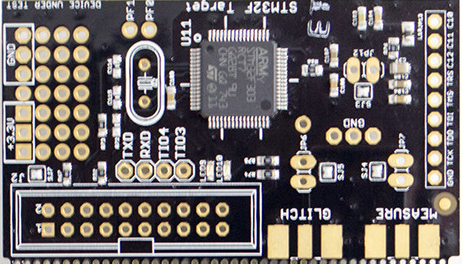
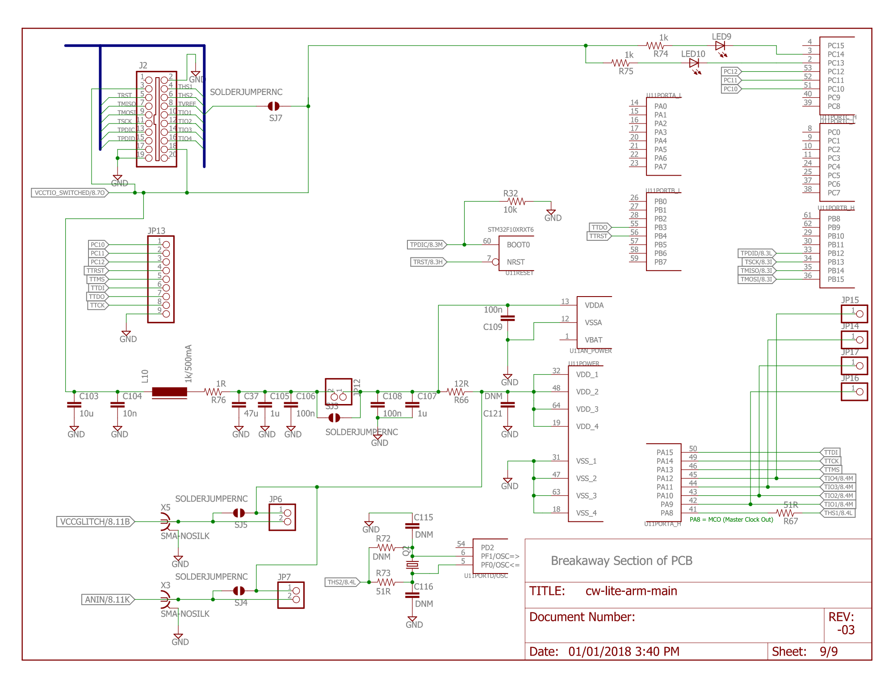

# CW303 Arm Target

The ChipWhisperer-Lite board has a break-away target board section. This
target can be used attached to the CW-Lite or separated and connected
via ribbon cable. The breakaway target board has a slightly different
feature set than the CW308T-STM32F3 target board. For more info,
see the CW308T-STM32F documentation.



--- 
## Specifications
| Feature | Notes/Range |
|--------|-----------|
| Target Device | STM32F303RCT6 |
| Target Architecture | 32-bit Arm Cortex-M4 |
| Vcc | 3.3V |
| Programming | STM32F Serial Bootloader, JTAG, SWD |
| Hardware Crypto | No |
| Availability | ChipWhisperer-Lite 32-bit |
| Status | Released |
| Shunt | 12Ω |

Available with the [ChipWhisperer-Lite 32-bit starter kit](../Starter%20Kits/ChipWhisperer-Lite.md)

### LEDs

The two LEDs on the STM32 board are active-low, which is done to reduce
the impact on power consumption in the VCC power signature. The
connections are as follows:

| Item  | Connection | Note       |
| ----- | ---------- | ---------- |
| LED9  | PC14   | Active low |
| LED10 | PC13   | Active low |

## Usage

### Building Firmware

Building Firmware for this target requires make and arm-none-eabi-gcc.
Installation of both these are covered in the {doc}`installation instructions <../installation>`.

If you have make and arm-none-eabi-gcc, you can build firmware by navigating via command line to the relevant
build directory and running:

```bash
make PLATFORM=CWLITEARM CRYPTO_TARGET=<CRYPTO_TARGET>
```

Typically `CRYPTO_TARGET` here is `TINYAES128C`, `MBEDTLS` or `NONE`.

If you're running a Jupyter Notebook lab, typically this step will be contained within one of the code blocks.

### Programming Firmware

The ChipWhisperer-Lite and ChipWhisperer-Pro have integrated STM32F UART programmers, meaning there's no need to use an
external one if you're using either. To program via the ChipWhisperer API:

```python
# ...assuming scope is setup
# ensure device has clock and IO is setup, typically via scope.default_setup()
prog = cw.programmers.STM32FProgrammer
cw.program_target(scope, prog, "<path/to/firmware.hex>")
```

### Increasing CLKIN

The STM32F303 has a max CLKIN input of 32MHz; however, to increase it above 24MHz, the flash latency must be increased.
Note that this may adversely affect clock glitching in particular. Flash latency can be increased in `firmware/mcu/hal/stm32f3/stm32f3_hal.c`

### Connectors

The following shows several of the connectors available on the CW303.

#### 20-Pin Connector

J2 is a 20-pin connector, which uses the standard NewAE 20-pin
connector pinout, documented [here](../Capture/20-pin-connector.md).

#### SMA Glitch

The SMA glitch connector allows VCC glitches be inserted into the
VCC pin. This is done by shorting the resistive shunt R66. By
default it connects to the SMA measure connector, but can be
disconnected with the solder jumpers.

#### SMA Measure

The SMA measure connector allows power measurements to be taken
across resistive shunt R66. By default it connects to the SMA glitch
connector, but can be disconnected with the solder jumpers.

#### JP13

JP13 provides a pinout with a few extra IO pins,
as well as JTAG/SWD debug pins.

---

### Solder Jumpers


#### SJ3

Connects the output of the VCC filter to the STM32F3 VCC network.
Soldered by default.

#### SJ4

Connects the SMA Measure header to the resistive shunt. Soldered by
default.

#### SJ5

Connects the SMA Glitch header to the resistive shunt. Soldered by
default.

#### SJ7

Connects the VCC of the STM32F3 board to VREF on 20-pin header.
Soldered by default.

---

## Mounting Jumpers

Note the ChipWhisperer-Lite main board and target section contain a number of jumper options. By default these are not mounted, and solder jumper bridges on the PCB have been bridged to select the appropriate options when required. Some options are only solder jumpers, which to move the jumper requires a soldering iron to bridge or clear the appropriate connections.

The following lists jumpers on the ChipWhisperer-Lite / Target Section: 

* JP7 connects the "MEASURE" SMA to the STM32F3 VCC Rail. Shorted by default with SJ4
* JP6 connects the "GLITCH" SMA to the STM32F3 VCC rail. Shorted by default with SJ5
* JP12 can be used to feed an external voltage into the XMEGA VCC rail. By default SJ3 connects this to 3.3V
* SJ2 selects if the 3.3V rail comes from the 20-pin IDC connector (i.e. ChipWhisperer-Lite board) or via an optional
LDO and USB connector

## Schematic


