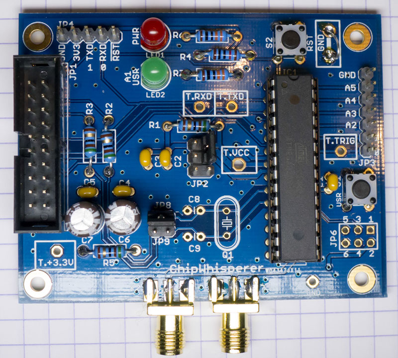
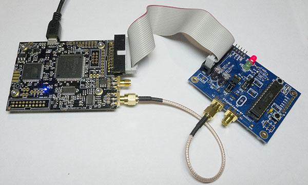
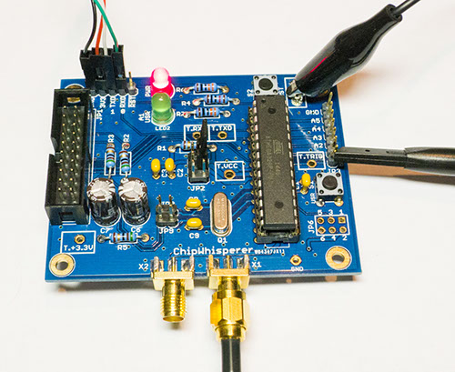
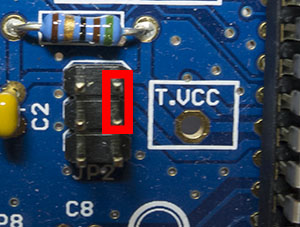
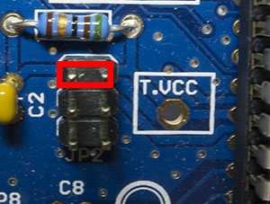
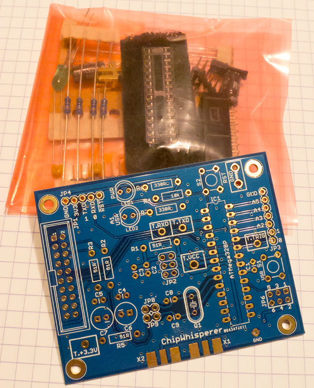
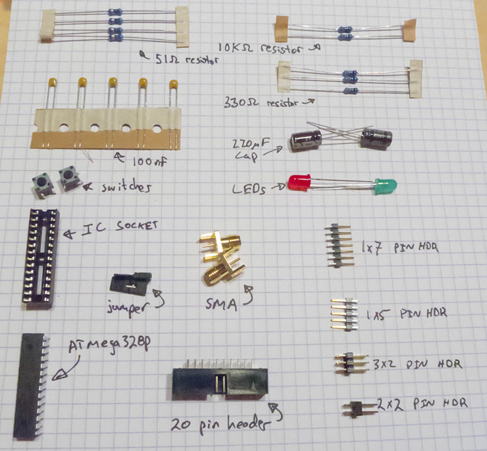
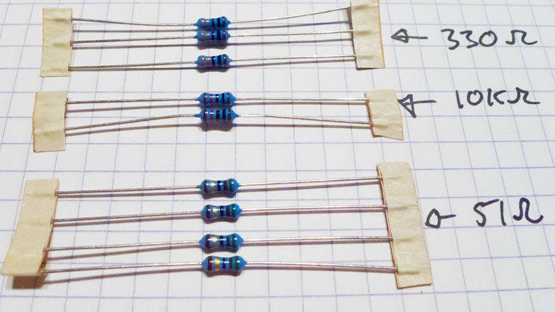
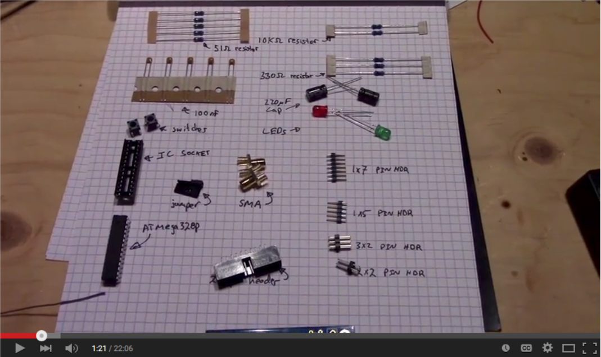
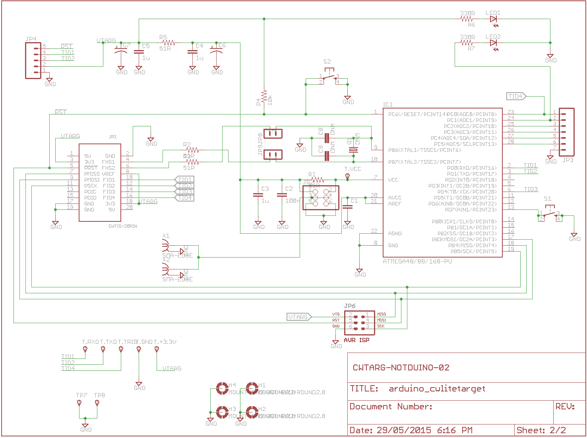

# CW304 Notduino Target

The Notduino is used as a target for the ChipWhisperer Capture system.
This includes interfacing to the CW-Lite (CW1173) and related platforms.



[Datasheet](http://media.newae.com/datasheets/NAE-CWLITE-NDKIT_datasheet.pdf)

---

## Specifications
| Feature | Notes/Range |
|--------|-----------|
| Target Device | ATMega328P |
| Target Architecture | 8-bit Harvard |
| Vcc | 3.3V |
| Programming | ISP |
| Hardware Crypto | No |
| Availability | PCB + Components (Unsoldered) |
| Status | Released |
| Shunt | 51Ω |

Available from [Mouser](https://www.mouser.com/ProductDetail/NewAE/NAE-CWLITE-NDKIT-01?qs=PzGy0jfpSMtlYfju9VNOXw%3D%3D) and the [NewAE Store](https://store.newae.com/notduino-kit/)

### Feature Set

  - 3.3V Operating Voltage
  - Atmel ATMega328P Microcontroller
  - Power analysis on VCC rail
  - Power glitching using CW1173 Crowbar
  - One user LED
  - One user push-button
  - Clock input or output line
  - 6 user I/O lines (including trigger to ChipWhisperer)
  - Optional crystal mounting holes
  - USART Lines for communication
  - Header to connect USB-Serial for Arduino bootloader usage

---

### Board Usage

The board is connected to the standard 20-pin target connector used on
the ChipWhisperer system. In addition you will require connection of the
SMA connector to perform power measurements:



Like most of our targets, the Notduino can be used without the capture
hardware. In this case the SMA connector is used to connect to the
regular oscilloscope, and a USB-Serial is used for communications:



#### **VCC Jumper Settings (JP2)**

JP2 uses our standard 6-pin connector, similar to the Multi-Target
board. On the NOTDuino board only the VCC shunt is present however,
which means you cannot perform measurements on a GND shunt.

Using the header in the following position is required for both
side-channel power analysis and voltage-glitching attacks:



If you are only doing clock glitching attacks (without associated power
measurement), you could short the jumper:



---

### Clock Jumper Settings (JP8/JP9)

The clock jumpers allow you to connect the HSOUT and HSIN lines to the
two XTAL pins on the ATMega328P. Normally you would mount JP8, which
routes the HSOUT line from the ChipWhisperer to the "External Clock
Input" on the ATMega328P.

You can also try mounting a crystal at Q1 (along with require capacitors
typically in 18pF-22pF range) at C8 and C9. If this is done, you will
need to ensure the fuses for the ATMega328P are programmed for the "Full
Output Swing", and you can then route the output of the crystal buffer
to CLKIN by mounting pin C9.

Finally, you can also solder a wire from pin 14 (PB0) of the ATMega328P
to pin 10 (PB7, the XTAL out pin). This allows you to enable the
internal oscillator of the ATMega328P, and also enable the "Clock Out"
pin. This clock output drives the internal oscillator frequency onto the
output pin, which you then route to the HSIN lines.

---

### Serial Header (JP4)

The serial header at JP4 provides a method of connecting a standard
serial cable to the NOTDuino board. Note the "RST" pin is broken out,
allowing you to use a serial cable with a "DTR" pin to control the reset
of the ATMega328P (which is required for the Arduino bootloader).

Note you will need to mount an appropriate crystal at Q1, along with C8
and C9 if not using the ChipWhisperer for a clock source.

| Silkscreen | ATMega328P | Arduino Name | Notes                                            |
| ---------- | ---------- | ------------ | ------------------------------------------------ |
| GND        | Ground     |              |                                                  |
| 3V3        | VCC        |              | If NOT connected to CW-Lite, can power from 3-5V |
| TXD        | PORTD.1    | Pin 1        | Output from AVR                                  |
| RXD        | PORTD.0    | Pin 0        | Input to AVR                                     |
| RST        | Reset      |              |                                                  |

---

### User IO Header (JP3)

The user IO header breaks out

| Silkscreen | ATMega328P | Arduino Name  | Notes   |
| ---------- | ---------- | ------------- | ------- |
| GND        | Ground     |               |         |
| A5         | PORTC.5    | Analog Pin A5 |         |
| A4         | PORTC.4    | Analog Pin A4 |         |
| A3         | PORTC.3    | Analog Pin A3 |         |
| A2         | PORTC.2    | Analog Pin A2 |         |
| 1          | PORTC.1    | Analog Pin A1 |         |
| 0          | PORTC.0    | Analog Pin A0 | Trigger |

---

### Using Arduino Software

If you wish to use the Arduino software with the NOTDuino board, there
is two main methods of doing that:

1.  Using ChipWhisperer-Lite as programmer.
2.  Using board entirely stand-alone.

#### **Using ChipWhisperer-Lite as Programmer**

If using the board with the ChipWhisperer-Lite attached (i.e. using the
ChipWhisperer-Lite as the capture hardware), this requires the fewest
modifications. To use the board you will need to:

1.  In the tutorials, set the CLKGEN frequency to 16.00 MHz instead of
    7.37 MHz.
2.  Use the integrated AVR programmer, program the compiled `.hex` file.
    This file can be found in two ways:
    1.  For Arduino 1.6.5 or later, there is an *Export Compiled Binary*
        from the *Sketch* menu.
    2.  For earlier version of Arduino, enable the *Show verbose output
        during compilation* in the *Preferences* menu. This will show
        you where the `.hex` file is located (NOTE: it changes after
        every compilation).

#### **Using Board Entirely Stand-Alone**

If using the board stand-alone, you will need to perform the following:

1.  Program the Arduino bootloader into the ATMega328P. This can be done
    with the ChipWhisperer-Lite programmer, or with a standard
    programmer and the 6-pin ISP header at JP6.
    Also program default fuses for the Arduino to select the external
    crystal.
2.  Mount a 16 MHz crystal at Q1, and appropriate capacitors at C8 and
    C9 (typically in range of 18-22pF depending on the crystal). Remove
    jumpers JP8 and JP9.
3.  Connect a USB-Serial adapter to JP4. You can connect the VCC line of
    a serial port to the "+3v3" line, as the board can be powered from
    5V **when not connected to the ChipWhisperer-Lite**. Never connect
    the board to a 5V line with the ChipWhisperer-Lite attached, as it
    will *destroy the ChipWhisperer-Lite*.

---

### Kit Assembly

The Notduino kit includes all the parts to assemble the Notduino kit.
The following shows the kit parts:



#### **Kit Parts**

Which you can break out into the following parts:



The following lists all the parts in the kit:

| Qty | Description                                                      |
| --- | ---------------------------------------------------------------- |
| 1   | NPCB-CWTARG-NOTDUINO-02                                          |
| 5   | 100nF Ceramic Capacitor (Marked with '104')                      |
| 2   | 220uF Electrolytic Capacitor                                     |
| 5   | 51-ohm 1/4W Resistor (Green Brown Black Gold Brown), 1 spare     |
| 3   | 330-ohm 1/4W Resistor (Orange Orange Black Black Brown), 1 spare |
| 2   | 10k-ohm 1/4W Resistor (Brown Black Black Red Brown), 1 spare     |
| 1   | Red 5MM LED                                                      |
| 1   | Green 5MM LED                                                    |
| 1   | ATMega328P-PU                                                    |
| 1   | 28-pin IC Socket                                                 |
| 2   | Tactile Push buttons                                              |
| 2   | Jumpers                                                          |
| 1   | 1x5 Pin Header                                                   |
| 1   | 1x7 Pin Header                                                   |
| 1   | 2x3 Pin Header                                                   |
| 1   | 2x4 Pin Header                                                   |
| 1   | 20-Pin Shrouded Header                                           |
| 2   | SMA Edge-Mount Connector                                         |

Note the resistors use a 5-band colour code, which is different from the
"regular" colour code you might be used to. The following shows the
resistors, note the colour code listed in the parts list above. Each of
the resistors have an extra provided, so when you assemble the board you
should have three left-over resistors.



#### **Assembly Process**

There is no specific assembly procedure for the board. The values of
components have been marked on the blank PCB, here are some general
instructions for the assembly process:

1.  You can use lead or lead-free solder due to the immersion gold
    finish of the PCB.
2.  Mount parts starting with the lowest height (such as resistors and
    ceramic capacitors) first.
3.  Note there is an extra of each of the resistors - i.e. you only need
    one 10k resistor (R4) but are provided two.
4.  Watch the polarity of LED1 and LED2. The flat edge of the LED should
    match the flat marking on the silkscreen.
5.  The electrolytic capacitors (C7 and C6) have the negative marked on
    them. Be sure to match up the negative with the "-" marking on the
    PCB. The two capacitors have the negative terminal facing each
    other.
6.  The shrouded header has an orientation - match up the notch in the
    20-pin header with the mark on the PCB silkscreen.
7.  See the picture at the beginning of this section for details of the
    assembly.
8.  The test-points (including the "GND") can be made using a cut-off
    resistor lead. This gives you something to clip a test point onto.

#### **Assembly Video**

You can see a [Video](http://www.youtube.com/watch?v=zCmWzpyEYe8&hd=1)
of the assembly process of YouTube:



---

### Troubleshooting

#### **Programming a New Notduino AVR**

Some users have had trouble programming fresh Notduinos from the
ChipWhisperer-Lite: attempting to read the AVR's signature or program it
causes the program to time out (with the message `USBError: [Errno 110]
Operation timed out`). This is generally because the ChipWhisperer-Lite
can't generate a clock speed slow enough to program a fresh AVR. 

As such, the ChipWhisperer can reduce its clock frequency
temporarily in order to program the fuse bytes,
allowing a fresh AVR's clock source to be changed to
an appropriate source (typically ext_clock).

The following code can be used to set the AVR's clock input
to ext_clock. From there, the ChipWhisperer can supply a fast
enough clock so that the slow clock mode is never needed again:

```python
import chipwhisperer as cw
scope = cw.scope()
scope.default_setup()
scope.io.tio1 = "serial_tx"
scope.io.tio2 = "serial_rx"

prog = cw.programmers.AVRProgrammer(slow_clock=True)
prog.scope = scope
prog.open()
prog.find()
prog.writeFuse("low", 0b11100000)
```

Once this is done, it is recommended that you unplug+replug the ChipWhisperer and
reconnect. Do not use the slow clock setting again. Other fuse bytes can be accessed by:

```python
# connect + setup...
prog = cw.programmers.AVRProgrammer(slow_clock=False)
prog.scope = scope
prog.open()
prog.find()
prog.writeFuse("high", <fuse_value>)
prog.writeFuse("extended", <fuse_value>)
```
---

### Schematic


