# CW310 Bergen Board (Kintex FPGA Target)


[ 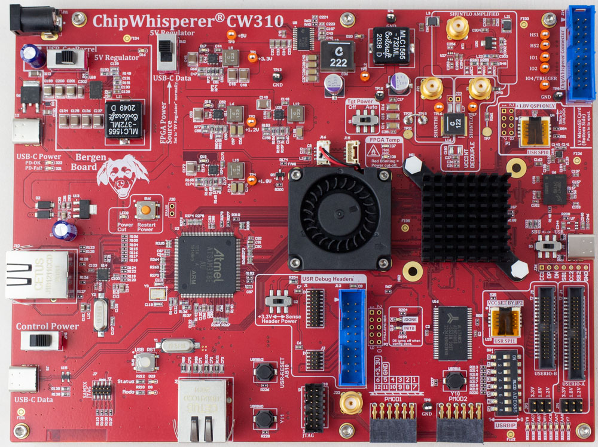 ](Images/cw310-bergenk410t.jpeg)

The ChipWhisperer CW310 "Bergen Board" is an advanced evaluation platform for FPGA-based security SoC, RoT, or HSM based designs. It is specifically designed to meet the needs of security evaluation purposes, while having the features you would expect in an easy-to-use FPGA development board.

```{admonition} Quick Reference to Schematics and More
:class: tip
For the schematic see [Schematic](#reference-material-schematics) section.
For FPGA examples see [Github Repo](https://github.com/newaetech/cw310-bergen-board).
```

This board includes a programmable microcontroller that communicates with the target FPGA. This microcontroller is responsible for tasks including:

* Configuring/reconfiguring the FPGA.
* Monitor the FPGA temperature, controlling fans, shutting down power if entering over-temp situation.
* Adjusting the core voltage.
* Controlling the on-board PLL to set required clock frequency.
* Allowing power cycling of the FPGA target.
* USB-serial ports for communication.
* Address/data bus which can be used as 30 computer-controller GPIO pins instead.
* Generic SPI interface.

This makes it simple to port new designs to the board. You can either use our example design with an integrated Python framework, or simply use basic serial port or bit-banging functionalists. The firmware for the microcontroller is open-source, and the python control logic is part of the open-source ChipWhisperer software.

In addition, the board includes several useful features for development of SoC like devices:

* 2x QSPI sockets - one with 1.8V fixed VCC, one with adjustable VCC.
* Standard JTAG headers that are compatible with most Arm & RISC-V debug probes.
* USB with PHY chip.
* PMOD headers
* Spare I/O headers that mate to 0.05" IDC cables.
* DDR3 memory.
* SRAM memory.

The board also contains multiple features specific for power analysis & fault injection testing:

* Multi-stage filtering of VCC-INT power supplies to reduce noise.
* On-board inductive "shunt" for power measurements.
* On-board LNA for improved SNR of power measurements.
* Bridgeable test points for performing other operations with VCC-INT supply.
* Cross-flow fans allow access to die for EM probing or EMFI fault injection.
* SMA connectors for voltage fault injection.

## Block Diagram & Overview

You can see a block diagram of the board below:

[ ") ](Images/cw310-blockdiagram-whitebackground.png)

An overview of all the location of various board features are given below:

[ 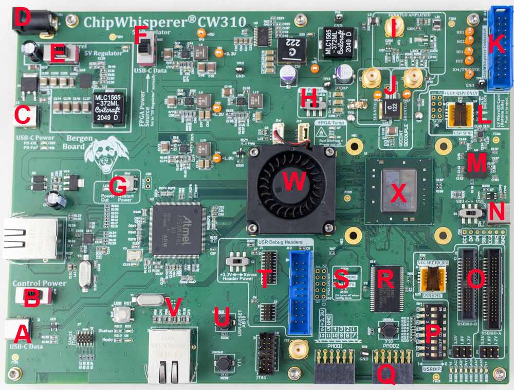 ](Images/cw310-bergenk410t_annotated.jpg)

* **A**: USB-C connector for computer control & power.
* **B**: Control power switch.
* **C**: USB-C connector for power only (requires specific PD profile, see section X).
* **D**: Classic DC barrel jack input, 9V to 20V (12V wall wart supplied).
* **E**: Switch for input to 5V regulator selection on board.
* **F**: Switch for main power source selection.
* **G**: Indicator of power cycling or thermal overload & switch to restart power.
* **H**: Target power on/off switch (switches FPGA power on/off).
* **I**: Amplified shunt measurement for power analysis.
* **J**: Inductive based shunt with high & low measurement ports. Can also be used for fault injection.
* **K**: ChipWhisperer 20-pin standard connector.
* **L**: 1.8V QSPI socket.
* **M**: DDR3 memory.
* **N**: User USB-C connector (requires USB implementation on FPGA).
* **O**: User expansion headers, 0.05" male headers, adjustable voltage per header.
* **P**: User DIP switches & LEDs.
* **Q**: 2x PMOD headers.
* **R**: SRAM
* **S**: Configuration status & debug header.
* **T**: User soft-core debug headers.
* **U**: User push-buttons (suggested for reset signal).
* **V**: User 10/100 ethernet.
* **X**: Kintex FPGA (K410T or K160T).
* **W**: Cross-flow cooling fan.

## Power Supplies & Monitoring

The CW310 uses a 5V supply as the "main supply voltage". Normally, a *8-20V input → 5V output* regulator is used to supply this, where the input voltage comes from a DC barrel jack or a USB-C power supply ('phone charger').

From this 5V supply, the following are derived:

* 5V → 1V VCC-INT (10A, voltage adjustable via Python)
* 5V → 1.8V Aux
* 5V → 3.3V I/O voltage
* 5V → 1.2V spare

The normal operating mode of the board is to use a higher voltage input, supplied from a USB-C wall adapter or DC barrel jack, which generates the main 5V supply for the board. This configuration is set by switch SW2 as shown here:

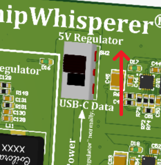

As an alternative, you can also take the 5V supply from the "control" USB-C controller. This is normally not recommended, as the current requirement can exceed what a typical computer/laptop is willing to supply out of it's USB-C port (and even worse if you use the USB-A to USB-C adapter).

```{admonition} Warning: Do as we say, not as we do
:class: warning
Even though we don't recommend it, in practice it can be very handy to power
everything from the single USB cable. If you are working with the smaller K160T
device it *can* be supported by the USB port power for most normal designs, and
the K410T can be used for very light work. It's suggested to confirm the power
draw with a USB current monitor in this case. You'll notice many of our photos
of the board will have only the USB data cable attached.
```

You can toggle the target portion of the power supplies off using switch S1, labelled "Tgt Power" on the PCB:

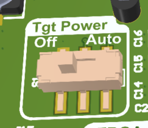

When set to "off", the power supplies on the FPGA side will be turned off, and signals driving the FPGA will be disabled. When set to "auto", the target power is controlled by the API (default is "on", but the user can now toggle it). This switch can be used to quickly turn the target power off without closing the USB computer connection, or to quickly toggle the target power to clear any corrupt configuration data.

The USB control power can be toggled on and off with switch SW7, near the USB-C data connector. This allows you to effectively turn off the entire board. Note the "USB-C PD" status LEDs may still stay on here, as there is still power applied via that connector (but disabled to the rest of the board).

### Power Good Monitoring

The power good outputs are monitored by the microcontroller. If they cycle several times (indicating the device is struggling to maintain power), the device goes into fail-safe mode which shuts off the target power. This will often occur if your source power supply is insufficient, but could also indicate a short (such as an accessory board is shorting out). The failure will be indicated by the "Surge" LED coming on:

{width=300}

If this happens, double-check the setting of the 5V source switch - be sure you are using the on-board 5V regulator instead of just taking power from the control USB-C port. You can restart the regulators with the "Restart Power" button once you have rectified any latent faults.

This button will also be used to recover from thermal faults.

NOTE: These faults can also be cleared via the Python API, allowing fully remote usage.

### USB-C PD Profiles

If using the USB-C power-only port, the board will attempt to request one of these power profiles:

* 20V

If the attached supply is not detected or does not provide this, the 'PD Fail' LED will come on.

```{admonition} Note: USB-PD LEDs can be confusing
:class: note
The "PD-FAIL" LED is on if the board is powered from another source besides the USB-C PD port. This is normal.
When connecting a USB-C power brick you may also see the "PD-OK" come on momentarily, which
happens when the initial 5V supply is OK, but then it will go out and "PD-FAIL" comes on when the further
negotiation failed.
```


## Thermal

The CW310 integrates a FPGA thermal monitor, and turns on fans as required. If the temperature gets too high, it also kills power to target side to protect the FPGA from cooking itself.

```{admonition} Warning: CW310 is not for frying eggs
:class: warning
You shouldn't be regularly tripping the thermal overload. The use of the cross-flow fan with an exposed die is often enough to
keep the FPGA in a safe operating range. If you need more cooling with an exposed die, consider mounting a heatsink on the rear
of the PCB.
```

### Fans

Due to the access required to the FPGA top-side when performing certain security evaluation work, the CW310 can be physically set up to use one of four fans (all four are driven from the same signal):

* Top-side cross-flow fan (for heatsink or exposed die backside work).
* Top-side heatsink mounted fan.
* Bottom-side cross-flow fan (best with heatsink).
* Bottom-side heatsink mounted fan.

The cross-flow fan is part number `BFB03505HHA-A`, the heatsink mounted fan is part number `MR3010H05B1-RSR`. The cross-flow fan is shown mounted on the board below:

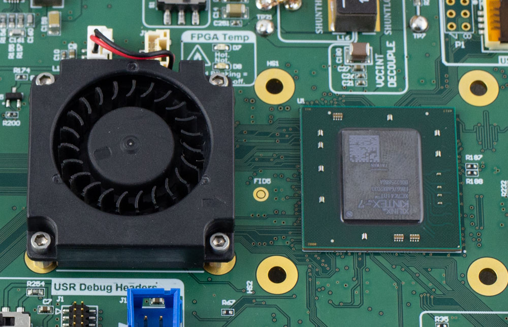{width=75%}

The fan PWM speed is automatically controlled, and can cycle on/off which you may find annoying. If you prefer to have a constant fan speed, you can specify a "minimum pwm" speed using this python command:

```python
TODO
```

Note the same PWM is sent to both the cross-flow and heatsink fan. The heatsink mounted fan responds differently than the cross-flow fan, so you may find it necessary to change the minimum speed value depending on the fan you have mounted. If you want to add a different fan

* Housing: GHR-04V-S
* Contacts: SSHL-002T-P0.2
* Crimp tool for contacts: YRS-1590

The pinout for the fan header is:

| Pin Number | Function
|------------|---------
|      1     |   GND (Constant)
|      2     |   +5V (Constant)
|      3     | No Connection
|      4     |   GND / PWM

For most fans connect the red (+5V) to pin `2`, and connect black (GND) to `4`. Many fans have a tachometer output which is unused - you can connect this to pin 3 or cut the wire.

Some fans will have a PWM input as well - in which case you can connect the PWM input to pin `4`, and the black GND to pin 1. This will require you to reverse the PWM polarity on the SAM3X (firmware change needed).

### Heatsink

The board is designed to work with `960-29-18-D-AB-0` to which a 9mil thick piece of thermal pad is added to reduce risk of damage on the chip. For this heatsink, fan part number `MR3010H05B1-RSR` can be mounted on it using M3 bolts. You can even choose to mount both fans at once, for example from the topside:

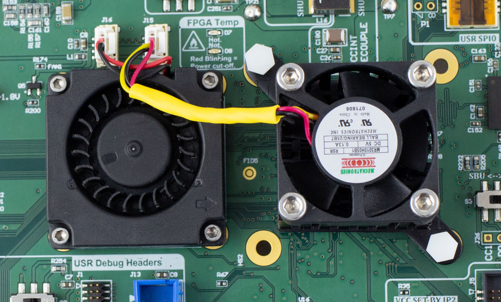{width=75%}

However one of the most effective uses of the dual fan setup is when the cross-flow fan is mounted on the front-side, and the heatsink fan is mounted on the backside of the PCB. This allows access to the die with the most amount of cooling still possible.

### Thermal Monitoring

The two LEDs indicate the thermal status:

1. Green = temperature is below 55C.
2. Red solid = temperature is 55C to 65C.
3. Red blinking = temperature is above 65C and FPGA power was shut off.

{width=50%}

Once the temperature is above 65C the power is immediately cut to the target device. The die temperature is still reflected in the LED state, but you will need to press the `Restart Power` button to bring the target power back (also can be done via a API call). If the target device temperature is above 55C, the power will not be turned onto the device.

{width=350}

You can read the FPGA temperature from the Python API as well.

## Configuration Options

The mode switches on the bottom of the board allow you to set the M0/M1/M2 pins. Note that the microcontroller can override the DIP switch settings - this is done to make it easier to work with the board, as most normal usage of the board will automatically set the mode switches.

If you use the Python API to configure the device, it will automatically override the mode switches to what Xilinx calls "slave serial" mode (referred to as "controller driven" for clarity here) for example. This serial mode is the *default and supported configuration mode* for most users.

### Controller Driven Serial Configuration

The default mode of loading a bitstream into the board is over the USB interface, which happens with the Python API. This allows simple integration of your target into a larger test environment without relying on additional connections.

This configuration is moderately fast - the current firmware loads an uncompressed K160T bitstream in 6 seconds, and an uncompressed K410T bitstream in 16 seconds. The bitstream compression feature can be enabled which results in significant loading time improvements, especially for small designs. 

### Configuration Failure Detection

Two methods are used to detect configuration failure. The most basic is the `DONE` pin, which goes high when the device is configured successfully. When the `DONE` pin goes high LED `D6` will also *turn off*.

The `INITB` signal is also routed to LED D10, in addition to being monitored by the controller. You can configure the FPGA to perform an automatic "continuous CRC" function which will flag configuration errors as they occur. If using the board for fault injection this is **mandatory**. You can monitor the status of the INITB flag via the Python API.

### Configuration Signal Breakout

For debugging purposes, several of the signals related to configuration are broken out on header P2 with the pinout shown here:

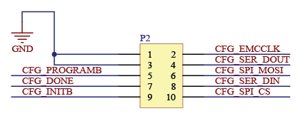

See [Page 11 of the Schematics](#reference-material-schematics) for more details of this header.

### Xilinx JTAG Configuration & Debug

A standard 14-pin Xilinx JTAG header is provided, which also allows usage of debug tools such as ILA cores via a Xilinx Platform USB Cable (not included). Note you can still configure the FPGA via the USB interface even if using the JTAG header for debug access.

## Power Analysis Options

Yes.

```{admonition} Coming Soon
:class: note
This section is coming shortly.
```


## USB Interface (via SAM3X)

The CW310 integrates a SAM3X microcontroller that provides the host USB interface. This microcontroller is preloaded with firmware that provides features such as:

* High-speed USB interface to computer.
* Management of power, PLL, and thermal monitoring chips.
* Simple address/data bus to read/write data into FPGA.
* FPGA configuration.

The firmware written to the SAM3X is open source and can be modified for your own use. This microcontroller can also be used to perform ultra high speed captures, by offloading the test vector generation onto the microcontroller itself.

For more information on the USB/SAM3X microcontroller, see the `microfw` directory.

### USB Serial Ports

The SAM3X exposes two USB-CDC serial ports with the default firmware. On plugging the USB-C data connector in, you should see two USB serial ports on your host. These ports are connected on the FPGA as follows, where the direction is relative to the FPGA (i.e. - the keyword you would use in your top module):

| Name | FPGA Pin | FPGA Direction |
| ---- | -------- | -------------- |
| RXD0 | AB22      | `output`       |
| TXD0 | AA24      | `input`        |
| RXD1 | AA22      | `output`       |
| TXD1 | W24      | `input`        |

These  act as normal serial ports, with a configurable baud rate from the host computer. Note that as these are implemented in the SAM3X you can modify them to route the serial data to another location instead of USB, or perform any filtering or processing you require. The default operation mode is a standard serial port (similar to a FTDI chip or similar).

### Ethernet MAC/PHY

The SAM3X includes a 10/100 Ethernet MAC & PHY. This is currently unused with the default firmware, but you can use this to provide the same features as the USB interface but over Ethernet (helpful for using many target boards).

## Memory

```{admonition} Tip: Save yourself some typing!
:class: tip
See the Github repository for a complete XDC file for this board, the following includes FPGA pin locations for reference but you can simply copy 
from the provided XDC file.
```


### User QSPI Sockets / QSPI Chips

One or two user QSPI sockets are present. This is designed to fit standard 6x8 WSON package QSPI chips. The expected pinout of the chip is as follows:


Part `U29` is always a QSPI socket, part `U4` may be a QSPI socket or may be a soldered-on board QSPI chip depending on the board variant (contact us to confirm if required).

Part `U4` has a fixed 1.8V VCC, part `U29` has a variable VCC that matches the USERIO-B header (which can be 1.2 -- 3.3V).

```{admonition} Note: Variable VCC provided by FPGA Banks
:class: note
The variable translation is provided by the actual FPGA bank power supply. This allows the absolute highest performance I/O since
you have no "translator" in the way. But you need to specify the `IOSTANDARD` in the XDC file to match your expected voltage.
```

#### 1.8V VCC QSPI Socket or On-Board SPI

Part `U4` is either a soldered-down QSPI chip or a WSON socket.

The connection between QSPI and FPGA is given below:

| QSPI Pin | QSPI (SPI) Name | FPGA Pin | Net Name |
| -------- | ---------       | -------- | -------- |
| 1        | CS#       | AE11 | USR_SPI0CS
| 2        | DQ1 (DOUT) | AE10 | USR_SPI0DQ1
| 3        | DQ2 (WP#) | AF9 | USR_SPI0DQ2 
| 4        | GND       | GND | 
| 5        | DQ0 (DIN) | AE8 | USR_SPI0DQ0
| 6        | CLK       | AF8 | USR_SPI0CLK
| 7        | DQ3 (HOLD# or RESET#) |AF10 | USR_SPI0DQ3
| 8        | VDD       | 1.8V | 

If soldered on-board, part number `IS25WP128-JLLE` is normally used (but due to supply chain issues other parts may be substituted, confirm if you require a specific part). If the socket is installed, the same part number (`IS25WP128-JLLE`) can be installed in the socket.

Part number `IS25WP128-JLLE` is a 1.8V only QSPI chip.

#### USERIO-A VCC QSPI Socket

Part `U29` is a socket that fits a WSON68 sized chip, tested for example with Micron `MT25QL256ABA1EW9-0SIT` (the same part used in the FPGA configuration).

The connection between QSPI and FPGA is given below:

| QSPI Pin | QSPI (SPI) Name | FPGA Pin | Net Name | 
| -------- | --------- | -------- | ---------|
| 1        | CS#       | F14 | USR_SPI1CS |
| 2        | DQ1 (DOUT) | A15 | USR_SPI1DQ1
| 3        | DQ2 (WP#) | B15| USR_SPI1DQ2
| 4        | GND       | GND
| 5        | DQ0 (DIN) | E11| USR_SPI1DQ0
| 6        | CLK       | F12 | USR_SPI1CLK
| 7        | DQ3 (HOLD# or RESET#)| F13| USR_SPI1DQ3
| 8        | VDD       | 1.8V

#### Using SPI Sockets

To use these sockets, carefully press down slightly and slide the top in the direction of the "UNLOCK" arrow. Once unlocked, the top will open up slightly. Carefully open it the full amount to release the chip - watch when opening the bottom may need to slide slightly, there shouldn't be any resistance in the opening process.

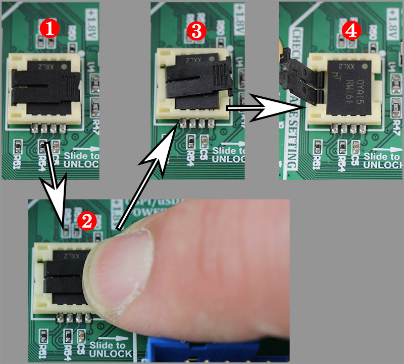

### MicroSD Card

a MicroSD card is also present for user use. The MicroSD card has the following pinout for the FPGA:

| Micro SD Pin | Micro SD Name | FPGA Pin | Net |
| -------- | --------- | -------- |------|
| 1        | DAT2      | AC7 | SDDAT2
| 2        | CD/DAT3   | AE7 | SDDAT3
| 3        | CMD       | AF7 | SDCMD
| 4        | VDD       | 1.8V
| 5        | CLK       | AD8 | SDCLK
| 6        | GND       | GND
| 7        | DAT0      | AD10 | SDDAT0
| 8        | DAT1      | AB9 | SDDAT1
| --       | Card Detect | AD11 | SDDETECT


Note the MicroSD card routes to a 1.8V bank and is powered at 1.8V. Many MicroSD cards operate at 1.8V, but you can specifically look for "low voltage" (LV) MicroSD cards that should work at 1.8V.

MicroSD cards by specification start at 3.3V, and are they powered down to 1.8V by a command if they support 1.8V operation.

Due to FPGA bank limitations, the MicroSD lines are only 1.8V compatible on this board.

### SRAM

A 8Mbit (1MByte) SRAM chip is provided. It is organized as 8bits x 1024K, and has 55 ns access time.

See [Page 11 of the Schematics](#reference-material-schematics) or the XDC file for pinout.

### DDR3L

A Micron MT41K512M8DA-107 DDR3L is provided for user use (soft-core SoC, etc). The pinout of this matches the expected pinout as provided by Vivado MIG for the K160T & K410T.

To use the DDR3L chip, you will need to:

* Turn on the 200 MHz oscillator using signal `LVDS_XO_200M_ENA` (this is required to be a reference clock for the MIG).
* Turn on the 1.35V DDR3L power supply with `VDDR_ENABLE` (you should check the signal `VDDR_PGOOD` to confirm).

An example XDC file is provided that can be loaded during the MIG tool to assign pins correctly for the DDR3 on-board. Note the MIG tool needs both a 200 MHz reference clock and a system clock - but the system clock can only be certain multiples of the DDR3 frequency. If you want to run a simple setup, the suggested timing is as follows:

* Set DDR3 period to **3,076 ps** (325.1 MHz frequency) on page 5 of MIG wizard.
* On the next configuration page (page 6), use the **Input Clock Period Select** drop-down and select the **4998 ps** (200.08 MHz) system clock frequency.
* On the next page (page 7):
	* Specify the **System Clock** as **Differential**
	* Specify the **Reference Clock** as **Use System Clock**
	* Specify the **System Reset Polarity** as **Active Low**
* On the next page (page 8):
	* Specify **Internal Termination Impedance** as **40 Ohms**
* Load the DDR3 pinout from XDC file (or manually specify it so it matches board)
* On **System Signals Selection** (page 10):
	* Specify the **System clock pin** as **Bank 33**, pins **AC9/AD9**.
	* The **Reference clock selection** should be blanked out.
	* The **sys_rst** should go to **Bank 33** pin **Y7** (USRSW2 on PCB).
	* Pin out the other signals to LEDs if you wish feedback visually.

**NB: Be sure if using the example design to add pins to turn on the clock + DDR3 power which defaults to off due to pull-down resistors on the PCB.**

See the DDR3 setup details for more information.

## User Expansion Headers A / B

Two expansion headers are provided, which use standard 0.05" (1.27mm) pitch headers. These allow mating of either daughter boards or cables as required. These headers are shown here:

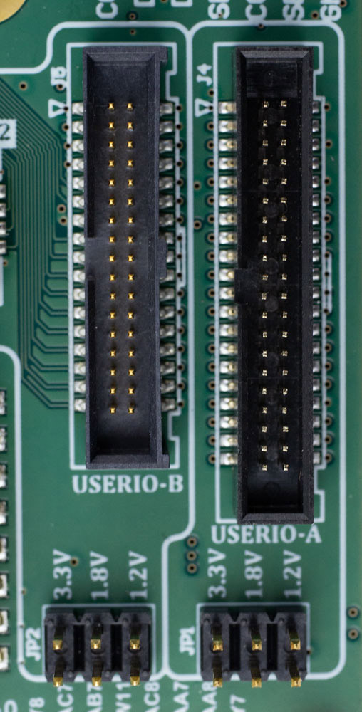{width=300}

Each header can be set to a separate I/O level, as each header routes to a different FPGA bank.

```{admonition} Warning: Very expensive mistake potential
:class: warning
The I/O voltage setting routes directly to the FPGA bank - do NOT apply higher than 3.3V as this will **destroy the FPGA**.
```

```{admonition} Note: Variable VCC provided by FPGA Banks
:class: note
The variable translation is provided by the actual FPGA bank power supply. This allows the absolute highest performance I/O since
you have no "translator" in the way. But you need to specify the `IOSTANDARD` in the XDC file to match your expected voltage.
```


You can drive an I/O voltage into the `VCCUSERIO` pin on each header, or you can set the voltage using jumper JP1 (USERIO-A) or JP2 (USERIO-B).

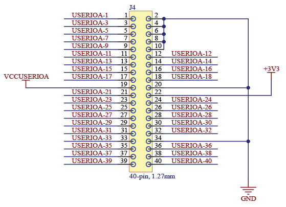

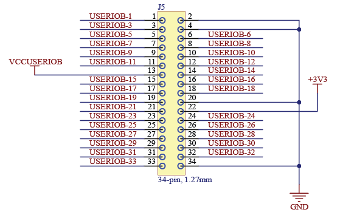

### Mating Headers

The use of 0.05"x0.05" headers makes it easy to use a variety of standard headers. Some useful part numbers for building breakout and adapter boards:

| Number Pins | Type                       | Mounting             | Part Number 
|-------------|----------------------------|----------------------|---------------
| 34          | Shrouded pin header        | SMD                  | SHF-117-01-L-D-SM-K-TR
| 34          | Sockets for cables         | IDC (Cable mount)    | M50-3301742
| 34          | Ribbon cable, 0.025"       | --                   | 3754/34 300
| 34          | Socket to Socket cable, 6" | --                   | FFSD-17-D-06.00-01-N
| 34          | Sockets for PCB mount      | Through-Hole         | M50-3002045
| 40          | Shrouded pin header        | SMD                  | SHF-120-01-L-D-SM-K-TR
| 40          | Sockets                    | IDC (Cable mount)    | M50-3302042
| 40          | Sockets                    | IDC (Cable mount)    | 3230-40-0101-00
| 40          | Ribbon cable, 0.025"       | --                   | 3754/40 300
| 40          | Socket to Socket cable, 6" | --                   | FFSD-20-D-06.00-01-N


## User PMOD Headers

Two PMOD headers are provided on the board. These provide 16 digital I/O signals (8 per header) along with 3.3V and GND pins. The I/O level for these headers is always 3.3V.

These allow any standard PMODs to be plugged into the board. The PMOD pinout is as follows (pin numbering follows PMOD "standard"):


See [Page 26 of the Schematics](#reference-material-schematics) for more detail on the connection.

These can be used to interface with a wide range of [PMod extensions from Digilent Inc](https://store.digilentinc.com/boards-and-components/expansion-modules/pmods/) and other vendors.

## User JTAG Headers

For soft-core implementations, several standard JTAG headers are provided on the board. Three standard headers are provided which reflect:

* 20-pin 0.1" JTAG (Arm Standard)
* 10-pin 0.05" JTAG/SWD (Arm Cortex-M) or RISC-V MIPI-10
* 20-pin 0.05" Trace/SWD (Arm Cortex-M) or RISC-V MIPI-20

Each of these includes a VCC pin. Switch S2 sets if the VCC pin is driven from the board with 3.3V ("+3.3V" setting), or if it connects via a resistor to the `USR_DBG_VCCDETECT` net which routes to FPGA pin `T19` to use for sensing purposes ("Sense" setting). Normally if you are implementing a soft-core & using the debug header, your debugger will require you to drive the VCC pin with 3.3V for detection purposes.

Switch `S2` allows these headers to be used for either standard debug connectivity, or to implement debugger connectivity in your FPGA.

See [Page 25 of the Schematics](#reference-material-schematics) for more detail.

## XADC Connections

An external reference is provided for the XADC. Three XADC pins are internally connected on the Bergen Board:

XADC Pin | FPGA Pin | Connection | Note
-------| ----------| ----------- | ----------
AD0P | C16 | USB-C User CC2 Pin | 0.24444x scaling factor
AD0N | B16 | GND
AD1P | B17 | USB-C User CC1 Pin | 0.24444x scaling factor
AD1N | A19 | GND 
AD8P | A18 | VCC-INT / 2 | For comparison of external vs. internal VCC-INT measurements (XADC has internal VCC-INT channel).
AD8N | A17 | GND

In addition, the USERIOA header contains several XADC capable ports. See [Page 13 of the Schematics](#reference-material-schematics) for more detail. Any FPGA pin name that ends in "ADxxN_15" and "ADxxP_15" is a ADC channel, where "xx" must be the same channel number to access both the positive and negative inputs. 

## User USB

An additional USB-C connector is provided that allows you to route a user USB signal. This is connected to a TUSB1106 full-speed USB phy.

See [Page 27 of the Schematics](#reference-material-schematics) for more detail.

## Firmware Upgrade

If you need to upgrade the firmware on the SAM3X (control microcontroller), this is currently done through two steps:

1. Erase the SAM3X, causing it to enter bootloader mode.
2. Program the SAM3X with the new firmware.

See the following for details of these steps.

```{admonition} Automatic Bootloader
:class: tip
Our other devices have a simplified "automatic" bootloader programmer -
currently the CW310 firmware isn't distributed with ChipWhisperer, so for now
use the following manual method.
```

### Step 1: Erasing the SAM3X

This can be done in two ways. Via Python:

```
import chipwhisperer as cw
target = cw.target(None, cw.targets.CW310)
programmer = cw.SAMFWLoader(scope=target)
programmer.enter_bootloader(really_enter=True)
```

Alternative, short the jumper holes marked "ERASE" (J20) with a paperclip, tweezers, etc.

If this part is successful, the leds D23 and D9 will be dimly lit. The CW310 will then **re-enumerate as a serial port**.

### Step 2: Reprogramming the SAM3X

In the following step, you may need to add explicit permission for the bootloader serial port. This is a different USB interface than is normally used by the device.

Get the latest firmware from GIT:

```
wget https://github.com/newaetech/cw310-bergen-board/raw/main/microfw/CW310/Debug/CW310.bin
```

And then:

```python
import chipwhisperer as cw
programmer = cw.SAMFWLoader(scope=None)
programmer.program('COM3', 'CW310.bin')
```

If this is successful you will see something like:

```
Opening firmware...
Opened!
Connecting...
b'\n\r'
Connected!
Erasing...
Erased!
Programming file CW310.bin...
Programmed!
Verifying...
Verify OK!
Bootloader disabled. Please power cycle device.
```

Press the "USB RST" button (SW5) on the board or power cycle it.

```{admonition} No Touch Bootloader
:class: tip
The latest git will support an automatic bootloader which does not require you
to power cycle or touch the physical board. If your board automatically
re-enumerates, you do not need to do the "USB RST" command.
```

## Reference Material (Schematics)

* [View schematics online](https://github.com/newaetech/cw310-bergen-board/blob/main/docs/BergenBoard_Rev06C.PDF)
* [Download PDF of Schematics](https://github.com/newaetech/cw310-bergen-board/raw/main/docs/BergenBoard_Rev06C.PDF)
* [Vivado XDC Constraint File](https://github.com/newaetech/cw310-bergen-board/tree/main/pins)
