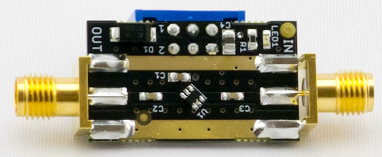
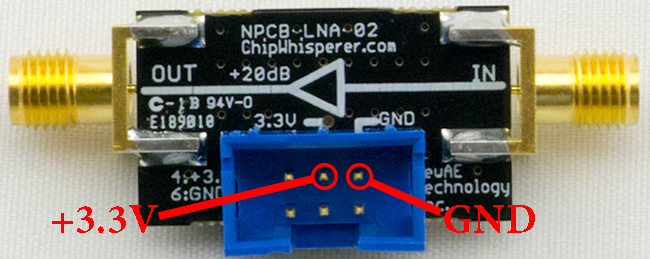
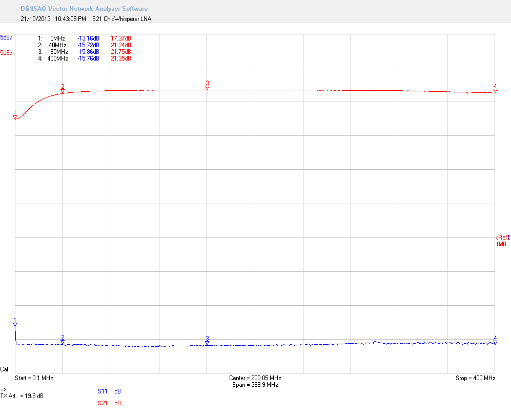
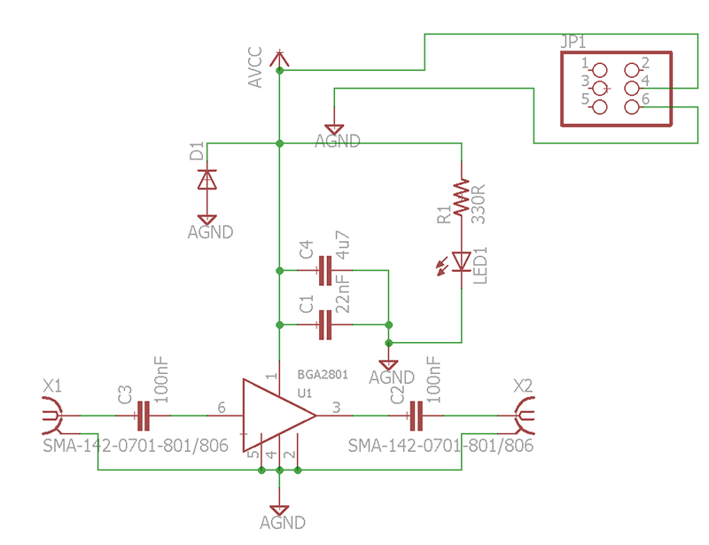

# CW502 Low Noise Amplifier

The LNA provides a simple amplifier for connecting equipment such as the
H-Probe to the ChipWhisperer, or other devices such as oscilloscopes and
spectrum analyzers. As the inputs are AC-coupled, it can also be used to
amplify the signal from a resistive shunt for connection to a regular
oscilloscope.

---

## Power

The LNA requires a power supply of between 3.0 - 3.6V. This is supplied
by the CW503 Probe Power Supply box, although you can also use a lab
power supply or other source.

---

## Typical Performance

The LNA is based on the BGA2801 device from NXP. See details in the
[BGA 2801
Datasheet](https://www.nxp.com/docs/en/data-sheet/BGA2801.pdf). But a
summary of important specifications are:

  - 20 dB gain up to 2GHz.

  - Typical 4 dB NF.
  - 2 dBm maximum power output at 1 dB compression point.

The following shows an example of S21 and S11 parameters for the LNA:

---

## Schematic

